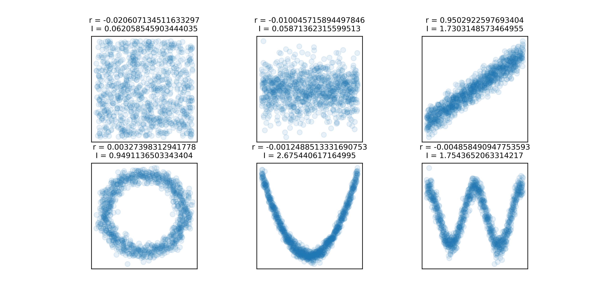

# libKSG

A performant implementation of the KSG mutual information estimator (first algorithm).
The algorithm is written in C with a Python wrapper provided for convenience.

Original publication:
```
Kraskov, A., Stögbauer, H., & Grassberger, P. (2004). Estimating mutual information. Physical Review E—Statistical, Nonlinear, and Soft Matter Physics, 69(6), 066138.
```
https://journals.aps.org/pre/abstract/10.1103/PhysRevE.69.066138

## Installation
The GNU Scientific Library is required for compilation, which comes shipped with most linux distros.

```SHELL
git clone https://github.com/LelouchLamperougeVI/libKSG.git
cd libKSG
make
make test
./test
```

## Usage
The main function takes a pointer ```x``` to an array of doubles of length ```N * 2```.
```C
double ksg(double *x, size_t N, int k)
```
The array is assumed to be a two-columns matrix presented in row-major form
(i.e. the first two entries correspond to the first elements on the two separate columns and so on).
The two columns represent the x/y coordinates of data points for a total of ```N``` points.
```k``` is the k-th nearest neighbour, as described in the publication.

> **NOTE:** Mutual information may be returned as negative.

### Python
The following Python wrapper is provided:
```python
ksg_mi(x: np.ndarray, y: np.ndarray, k=5)
```
> Parameters:
> >  x, y:   input vectors
> >
> >  k:      nearest neighbour
>
> Returns:
> >  I:      mutual information

# Example
Quick sketch with colab:

```python
!sudo apt-get install libgsl-dev
!git clone https://github.com/LelouchLamperougeVI/libKSG.git
%cd libKSG
!make

import numpy as np
from scipy.stats import pearsonr
import matplotlib.pyplot as plt
from ksg_mi import ksg_mi

n = 1_000;

fig, ax = plt.subplots(2, 3, figsize=(10, 5))

x = np.random.rand(n)
y = np.random.rand(n)
r = pearsonr(x, y)[0]
I = ksg_mi(x, y)
ax[0, 0].scatter(x, y, alpha=.1)
ax[0, 0].set_title("r = " + str(r) + "\nI = " + str(I), fontsize=9)

x = np.linspace(0, 1, n)
y = np.random.randn(n)
r = pearsonr(x, y)[0]
I = ksg_mi(x, y)
ax[0, 1].scatter(x, y, alpha=.1)
ax[0, 1].set_title("r = " + str(r) + "\nI = " + str(I), fontsize=9)

x = np.random.rand(n) * 10
y = x + np.random.randn(n)
r = pearsonr(x, y)[0]
I = ksg_mi(x, y)
ax[0, 2].scatter(x, y, alpha=.1)
ax[0, 2].set_title("r = " + str(r) + "\nI = " + str(I), fontsize=9)

theta = np.linspace(0, 2*np.pi, n)
phi = np.random.randn(n) + 10
x = phi * np.cos(theta)
y = phi * np.sin(theta)
r = pearsonr(x, y)[0]
I = ksg_mi(x, y)
ax[1, 0].scatter(x, y, alpha=.1)
ax[1, 0].set_title("r = " + str(r) + "\nI = " + str(I), fontsize=9)

x = np.linspace(-5, 5, n)
y = x**2 + np.random.randn(n)
r = pearsonr(x, y)[0]
I = ksg_mi(x, y)
ax[1, 1].scatter(x, y, alpha=.1)
ax[1, 1].set_title("r = " + str(r) + "\nI = " + str(I), fontsize=9)

x = np.linspace(0, 4*np.pi, n)
y = np.cos(x)*5 + np.random.randn(n)
r = pearsonr(x, y)[0]
I = ksg_mi(x, y)
ax[1, 2].scatter(x, y, alpha=.1)
ax[1, 2].set_title("r = " + str(r) + "\nI = " + str(I), fontsize=9)

for a in ax.flatten():
    a.set_xticks([])
    a.set_yticks([])
    a.set_box_aspect(1)
```
